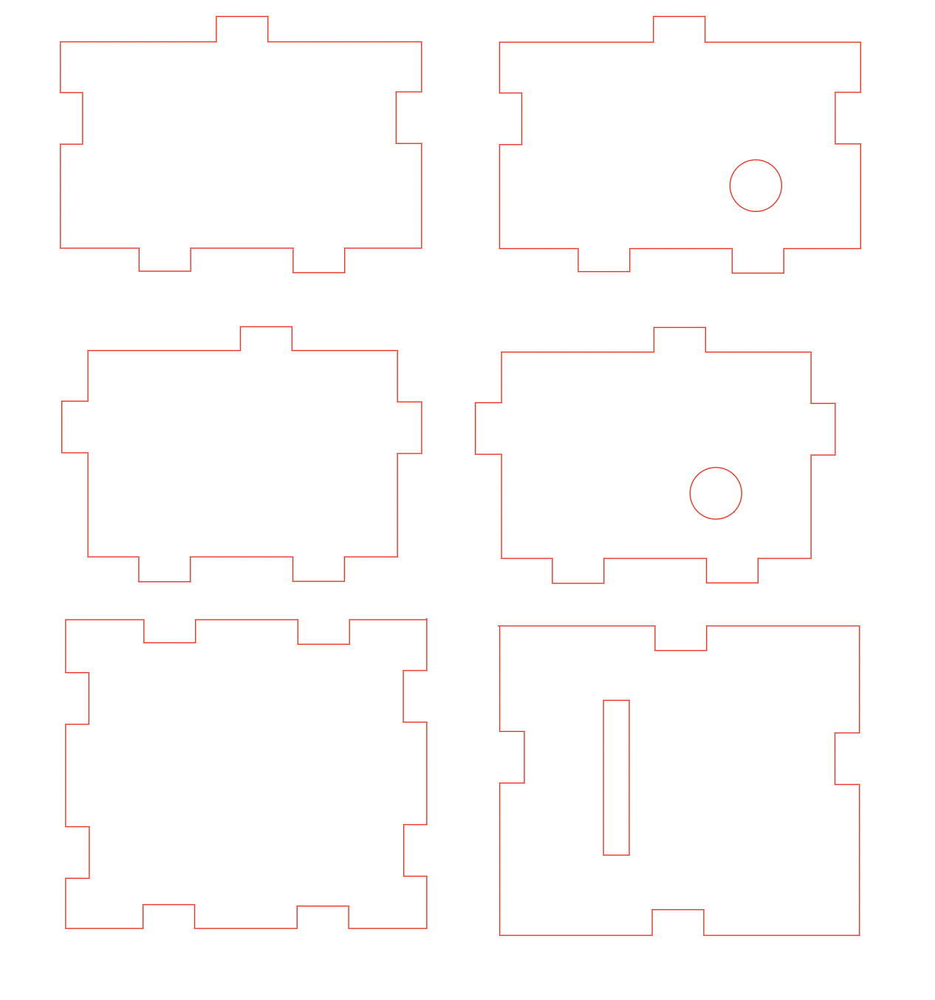

<h1> ECE 196: Sprinkle Bot </h1>

### **Team Members:** *Steve Gisqu, Prem Shelat, Raymond Urbina* 
***
## **Table of contents:**
- [**Table of contents:**](#table-of-contents)
  - [**Raspberry Pi 4 Operating System Download Instructions:**](#raspberry-pi-4-operating-system-download-instructions)
  - [**Installing Visual Studio Code on Raspberry Pi 4:**](#installing-visual-studio-code-on-raspberry-pi-4)
  - [**Python Code Scripts Used for Automated Watering System:**](#python-code-scripts-used-for-automated-watering-system)
  - [**PCB Design for Sprinkle Bot:**](#pcb-design-for-sprinkle-bot)
  - [**Sprinkle Bot Enclosure:**](#sprinkle-bot-enclosure)
  - [**Hardware Used for Sprinkle Bot:**](#hardware-used-for-sprinkle-bot)
  - [**Website:**](#website)
  - [**Video Demo of Sprinkle Bot:**](#video-demo-of-sprinkle-bot)
  

### **Raspberry Pi 4 Operating System Download Instructions:**
- The rasberry operating system is to be downloaded from (https://www.raspberrypi.com/software/)

### **Installing Visual Studio Code on Raspberry Pi 4:**
- Link to installation instruction (https://code.visualstudio.com/docs/setup/raspberry-pi)
- Installation instructions:
  - Open the Command line in raspberry pi and type the following commands
  - sudo apt update
  - sudo apt install code
  - Once installation is complete, Visual Studio will be present under the programming menu!

### **Python Code Scripts Used for Automated Watering System:**

### **PCB Design for Sprinkle Bot:**

### **Sprinkle Bot Enclosure:**

### **Hardware Used for Sprinkle Bot:**

| Part: | Quantity: |
| --- | --- |
| Raspberry Pi 4 | 1 |
| Enclosure | 1 |
| Custom PCB Board | 1 |
| Soil Moisture Sensor | 1 |
| Humidity Temperture Sensor | 1 |
| Sunlight Sensor | 1 |
| Water Pumps | 2 |
| Tubing for Water Pumps | 4 |
  
### **Website:**
https://premzal.github.io/index.html

### **Video Demo of Sprinkle Bot:**
https://youtu.be/eEHygGkTwr8
